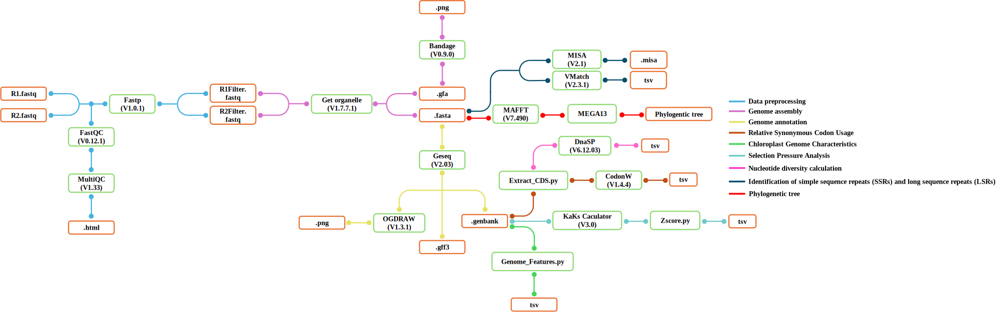

# Chloroplast Genome Analysis

General Workflow for Chloroplast Genome Analysis.



## 1. Data preprocessing
Raw paired-end FASTQ files are assessed for sequencing quality using **FastQC v0.12.1**, and quality reports are summarized with **MultiQC v1.33**. The reads are then processed using **Fastp** to trim low-quality bases, remove adapter sequences, and filter low-quality reads, producing high-quality paired-end FASTQ files for subsequent analyses.
### 1.1. Quality control using FastQC

```bash
fastqc \
  <path/to/input.fastq.gz> \
  -o <path/to/fastqc_output_directory> \
  -t 16
```
Với dữ liệu pair_end
```bash
fastqc \
  <path/to/input_R1.fastq.gz> \
  <path/to/input_R2.fastq.gz> \
  -o <path/to/fastqc_output_directory> \
  -t 16
```
### 1.2. Generate a summary report using MultiQC

```bash
multiqc \
  <path/to/fastqc_output_directory> \
  -o <path/to/multiqc_output_directory>
```
### 1.3. Read filtering and trimming using fastp
```bash
fastp \
  -i <path/to/input_R1.fastq.gz> \
  -I <path/to/input_R2.fastq.gz> \
  -o <path/to/output_R1.fastq.gz> \
  -O <path/to/output_R2.fastq.gz> \
  --trim_front1 10 \
  --trim_front2 10 \
  --detect_adapter_for_pe \
  --n_base_limit 5 \
  --html <path/to/fastp_report.html> \
  --json <path/to/fastp_report.json> \
  --thread 8
```
## 2. Chloroplast genome assembly
The cleaned paired-end reads, including the forward and reverse reads, are used for de novo chloroplast genome assembly using **GetOrganelle v1.7.7.1**. The assembly is performed using the `embplant_pt` database, which is designed for plant plastid genomes.

GetOrganelle generates several output files, of which two main formats are used in this workflow: the assembled sequence in **FASTA** format and the assembly graph in **GFA** format.

When the assembly is successfully completed, the FASTA file containing complete in its filename generally represents the `complete` assembled chloroplast genome and is used as the primary input for downstream analyses. The GFA file is used to visualize and inspect the assembly graph using **Bandage v0.9.0**.
### Khởi động môi trường Conda
```bash
conda activate getorg
```
### Lắp ráp de novo bộ gen lục lạp bằng GetOrganelle
```bash
get_organelle_from_reads.py \
  -1 <path/to/cleaned_R1.fastq.gz> \
  -2 <path/to/cleaned_R2.fastq.gz> \
  -o <path/to/assembly_output_directory> \
  -t 8 \
  -F embplant_pt \
  -R 15 \
  -k 21,45,65,85,105,127
```
## 3. Chloroplast genome annotation and visualization
The complete chloroplast genome sequence in FASTA format is annotated using the online tool GeSeq v2.03. Alternatively, CPGAVAS2 can be used for chloroplast genome annotation. GeSeq is specifically designed for rapid annotation of organellar genomes, particularly plastid genomes, while CPGAVAS2 is an integrated platform for plastome annotation and analysis. The GenBank results file containing the chloroplast genome annotation information will be visualized into a genome map using the OGDRAW tool (v1.3.1) integrated into GeSeq, which converts annotations into graphical maps and supports vector outputs such as SVG and PDF.
### Genome annotation using GeSeq

GeSeq web server:

```text
https://chlorobox.mpimp-golm.mpg.de/geseq.html
```

### Alternative annotation using CPGAVAS2

CPGAVAS2 web server:

```text
http://47.96.249.172:16019/analyzer/home
```
## 4. Chloroplast genome feature analysis

Following genome annotation, the annotated **GenBank files** are processed using custom **Python scripts** to summarize and analyze the structural and compositional features of the chloroplast genomes. The following characteristics are extracted:

- Total chloroplast genome length and the lengths of the **LSC, SSC, IRa, and IRb regions**.
- Total **coding sequence (CDS) length** and the proportion of CDS relative to the entire genome.
- Numbers of **protein-coding genes, tRNA genes, rRNA genes, and intron-containing genes**.
- **GC content (%)** of the complete chloroplast genome and the **LSC, SSC, and IR regions**.
- **AT content (%) at the first, second, and third codon positions** of the coding sequences.
- Detailed characteristics of **intron-containing genes**, including the **number of exons and introns, the length of each exon and intron, and the genomic coordinates and positions of each gene**.

The resulting data are summarized in tabular format for downstream comparative chloroplast genome analyses.
## 5. Phylogenetic tree
Kết quả trình tự bộ gen sau khi lắp ráp sẽ được xây dựng cây di truyền bằng công cụ 


